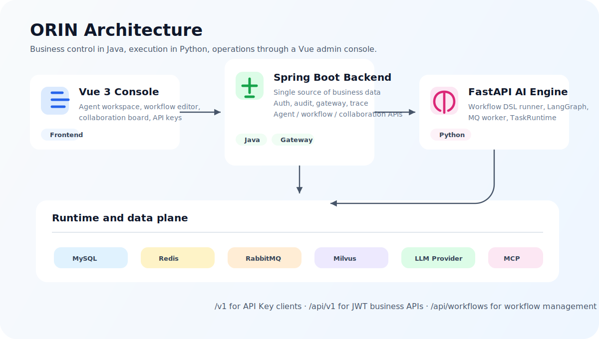
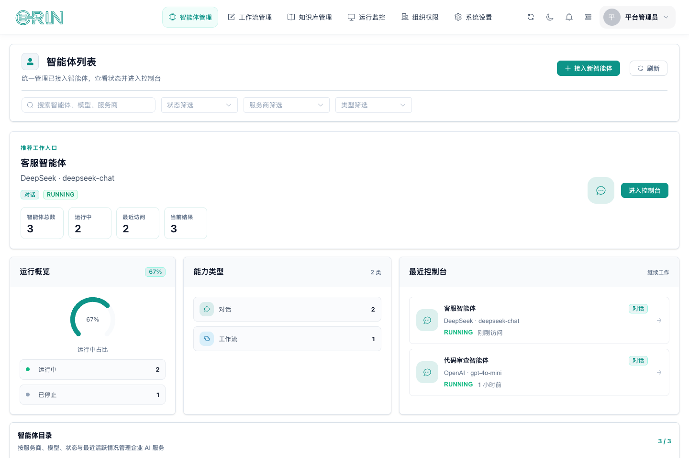
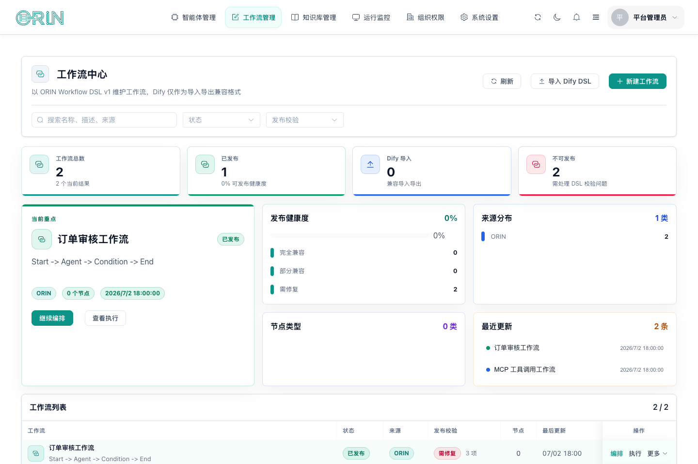
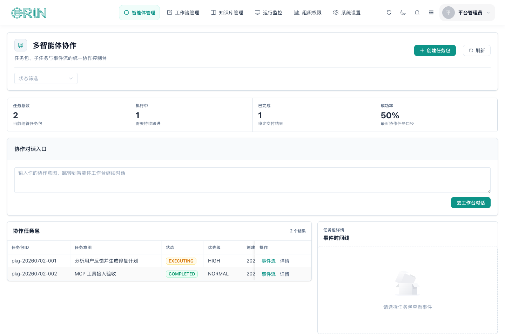
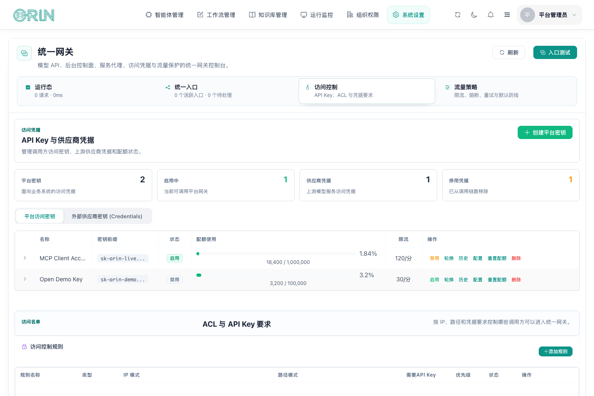
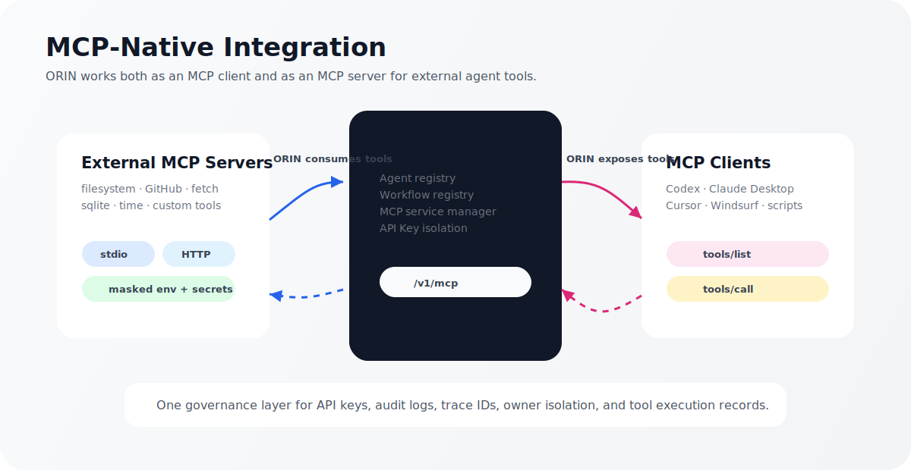
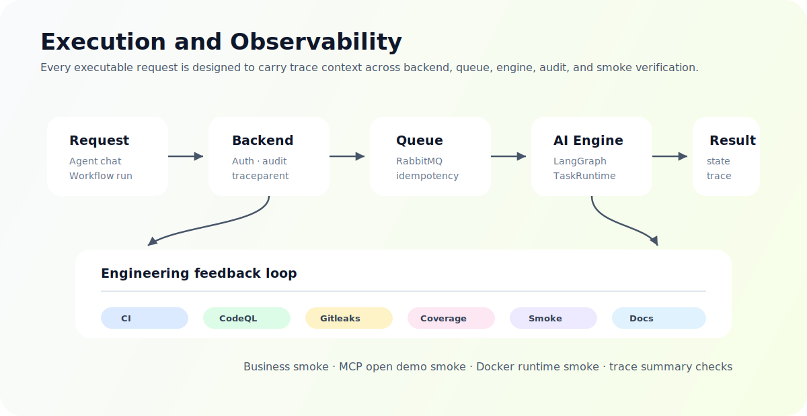

# ORIN

[](https://github.com/AdlinZ/ORIN/actions/workflows/ci.yml)
[](https://github.com/AdlinZ/ORIN/actions/workflows/codeql.yml)
[](https://github.com/AdlinZ/ORIN/actions/workflows/gitleaks.yml)
[](./docs/功能完成度.md#4-测试覆盖率基线)
[](./scripts/docker-smoke.sh)
[](./docs/mcp-client-setup.md)
[](./README.md#license)

> MCP-Native 多智能体管理平台。
> 面向 Agent 接入、工作流编排、MCP 工具生态与平台治理的一体化工程实践。

ORIN 是一个面向企业智能体场景的管理平台，覆盖 Agent 接入、OpenAI 兼容网关、API Key 治理、知识库、工作流编排、多智能体协作、MCP 工具接入与可观测性。项目采用 `Spring Boot + Vue 3 + Python FastAPI/LangGraph` 三层架构：Java 后端负责业务管控和唯一持久化，Python AI Engine 负责工作流/协作执行，Vue 管理台提供平台化操作入口。

项目包含 Docker quickstart、GitHub Actions、CodeQL、gitleaks、coverage artifacts、业务 smoke、MCP open demo smoke、文档手册和贡献流程。当前定位是“骨架完整、核心链路可验收、部分高级能力持续收敛”的开源项目。

## 为什么值得看

- **完整三端架构**：`orin-backend`、`orin-frontend`、`orin-ai-engine` 职责分离，前端不直连 AI Engine，AI Engine 不持久化业务数据。
- **MCP-Native 设计**：既能让 ORIN Agent 调用外部 MCP Server，也能把 ORIN Agent / Workflow 通过 `/v1/mcp` 暴露给 Codex、Claude Desktop、Cursor、Windsurf 等客户端。
- **执行链路可追踪**：Agent、Workflow、Collaboration 请求统一透传 `traceId / traceparent`，结合审计日志、Trace 聚合摘要和任务状态管理定位问题。
- **工作流与协作闭环**：支持 Workflow DSL 创建、发布、执行、失败 replay、取消保护；协作包通过 LangGraph 编排、MQ 分发和 `TaskRuntime` 执行。
- **安全与治理基线**：JWT roles 强校验、API Key 生命周期管理、敏感字段脱敏、gitleaks、CodeQL、Dependabot、审计日志和接口鉴权边界。
- **可复现实验入口**：提供 Docker smoke、业务 API smoke、MCP open demo smoke、schema baseline 检查和三端测试命令，方便 reviewer 直接验证。

## 架构概览



### 三层职责

| 层级 | 技术栈 | 职责 |
|------|--------|------|
| 后端主控层 | Spring Boot 3.2 · MySQL · Redis | 用户、角色、Agent、Workflow、Collaboration、API Key、审计、网关、业务数据持久化 |
| 前端管理台 | Vue 3 · Vite · Element Plus · Pinia | Agent 控制台、知识库、工作流、协作看板、网关/API Key、系统治理 |
| AI 执行层 | Python 3.11 · FastAPI · LangGraph | Workflow DSL 执行、多智能体协作编排、MCP 工具调用、任务运行内核 |

## 核心能力

| 能力 | 当前状态 | 可验证入口 |
|------|----------|------------|
| OpenAI 兼容网关 | API Key 鉴权、审计、限流/配额基础设施已建立 | `/v1/*`、`scripts/business-smoke.sh` |
| Agent 管理与对话 | 列表、接入、对话、工具绑定、Trace 可演示 | `/dashboard/applications/agents` |
| Workflow 编排 | DSL 校验、发布、执行、任务 replay/cancel、trace summary | `/dashboard/applications/workflows` |
| 多智能体协作 | 包/子任务/事件/人工干预入口、Workflow 子任务 smoke 已具备 | `/dashboard/applications/collaboration/dashboard` |
| MCP 双向接入 | 外部 MCP Server 管理；ORIN Agent / Workflow 暴露为 MCP tools | [docs/mcp-client-setup.md](./docs/mcp-client-setup.md) |
| API Key 治理 | 创建、禁用、启用、删除、轮换、调用摘要、最近历史、MCP 配置复制 | `/dashboard/control/gateway?workspace=access`、`/portal/api-keys` |
| 知识库 | CRUD、上传、解析、向量化、检索入口已具备 | `/dashboard/resources/center` |
| 可观测与安全 | traceId、审计、CodeQL、gitleaks、coverage artifacts、安全文档 | GitHub Actions、`/api/v1/traces/{traceId}/summary` |

更保守的完成度说明见 [docs/功能完成度.md](./docs/功能完成度.md)。项目明确区分“页面存在”和“能力闭环”，未完成项不会在 README 中伪装成已完成。

## 运行界面

以下截图来自前端运行时页面，使用 Playwright 注入演示数据生成，用于展示主要管理台入口的实际交互形态。

| 智能体管理 | 工作流中心 |
|------------|------------|
|  |  |

| 多智能体协作 | 统一网关与 API Key |
|--------------|--------------------|
|  |  |

## 30 秒启动

```bash
git clone https://github.com/AdlinZ/ORIN.git
cd ORIN
cp .env.example .env
docker compose --env-file .env up --build -d
```

启动后访问：

- 前端管理台：<http://localhost:5173>
- 后端服务：<http://localhost:8080>（Swagger：`/swagger-ui/index.html`）
- AI Engine：<http://localhost:8000>

`.env.example` 的默认值仅用于本机 smoke。真实部署或共享环境必须替换数据库密码、`JWT_SECRET`、`ORIN_DEFAULT_ADMIN_PASSWORD`、CORS、provider key 等配置。Docker quickstart 依赖 `docker/mysql/init/01-orin-schema.sql` 作为 schema snapshot baseline 初始化 MySQL，后端启动后由 Flyway 补跑快照之后的迁移。

## 验收命令

```bash
# Docker 运行态 smoke：容器 health、HTTP endpoint、Flyway、默认 admin、MCP route、业务 smoke
bash scripts/docker-smoke.sh

# 三端启动后的核心业务 API smoke
bash scripts/business-smoke.sh

# MCP open demo smoke
ORIN_API_KEY=sk-orin-... bash scripts/mcp-open-demo-smoke.sh

# 静态检查 Docker quickstart 配置，不等价于真实容器 smoke
bash scripts/check-docker-quickstart.sh
```

开发模式下可分别运行三端测试：

```bash
# backend
cd orin-backend && mvn test

# frontend
cd orin-frontend && npm run test && npm run build

# ai-engine
cd orin-ai-engine && venv/bin/pytest
```

## MCP-Native 演示



ORIN 的 MCP 设计包含两个方向：

1. **MCP Client**：ORIN Agent 可以接入 filesystem、GitHub、fetch、sqlite、time 等 MCP Server，并把 tools 注入到 Agent 可用工具列表。
2. **MCP Server**：ORIN 可以把当前 API Key 所属用户已暴露的 Agent / Workflow 注册为 MCP tools，供 Codex、Claude Desktop、Cursor、Windsurf 等客户端调用。

相关入口：

- 客户端配置：[docs/mcp-client-setup.md](./docs/mcp-client-setup.md)
- 开源演示验收清单：[docs/open-demo-checklist.md](./docs/open-demo-checklist.md)
- 本机 API smoke：`ORIN_API_KEY=sk-orin-... bash scripts/mcp-open-demo-smoke.sh`
- 真实 Agent / Workflow 调用：`ORIN_MCP_CALL_TOOLS=1 ORIN_API_KEY=sk-orin-... bash scripts/mcp-open-demo-smoke.sh`
- provider-backed Agent 强验收：`ORIN_OPEN_DEMO_AGENT_ID=<agent-id> bash scripts/open-demo-acceptance.sh`

## 工程化基线



- **CI/CD**：GitHub Actions 覆盖 schema baseline、backend、frontend、AI Engine、CodeQL、gitleaks。
- **测试与覆盖率**：三端 coverage artifacts 已接入 CI，当前覆盖率基线记录在 [docs/功能完成度.md](./docs/功能完成度.md#4-测试覆盖率基线)。
- **容器化**：Docker Compose 可启动 backend、frontend、ai-engine、MySQL、Redis、RabbitMQ。
- **安全维护**：`SECURITY.md`、Dependabot、CodeQL、gitleaks、API Key 脱敏审计、JWT roles 强校验。
- **文档与协作**：`CONTRIBUTING.md`、PR 模板、Issue 模板、管理员/开发者/用户手册、部署指南、API 文档。

## 目录结构

```text
ORIN/
├── orin-backend/      Spring Boot 主后端，业务管控与统一网关
├── orin-frontend/     Vue 3 管理台
├── orin-ai-engine/    Python FastAPI 执行引擎
├── docker/            本地基础设施与初始化脚本
├── scripts/           smoke、备份恢复、部署与检查脚本
├── docs/              架构、API、部署、路线图、手册
└── manage.sh          本地开发一键启停脚本
```

## 文档导航

| 文档 | 用途 |
|------|------|
| [docs/架构设计.md](./docs/架构设计.md) | 系统架构、模块边界、协作执行约束 |
| [docs/开发规范.md](./docs/开发规范.md) | 编码规范、PR 必检、禁止事项 |
| [docs/路线图.md](./docs/路线图.md) | 当前阶段、后续开发顺序与里程碑 |
| [docs/功能完成度.md](./docs/功能完成度.md) | 各模块成熟度与可验收能力 |
| [docs/API文档.md](./docs/API文档.md) | 接口分组、统一网关示例 |
| [docs/部署指南.md](./docs/部署指南.md) | 环境变量、本地/生产部署、检查清单 |
| [docs/使用指南.md](./docs/使用指南.md) | 前端导航与功能入口 |
| [docs/角色矩阵.md](./docs/角色矩阵.md) | 管理台角色入口、菜单可见性与权限边界 |
| [docs/mcp-client-setup.md](./docs/mcp-client-setup.md) | Codex / Claude Desktop / Cursor / Windsurf MCP 接入 |
| [docs/open-demo-checklist.md](./docs/open-demo-checklist.md) | MCP API smoke、Codex 客户端验收与外部客户端展示清单 |
| [docs/手册-管理员.md](./docs/手册-管理员.md) | 管理员操作手册 |
| [docs/手册-开发者.md](./docs/手册-开发者.md) | 开发者手册 |
| [docs/手册-用户.md](./docs/手册-用户.md) | 普通用户手册 |
| [CONTRIBUTING.md](./CONTRIBUTING.md) | 贡献流程、分支与 PR 规范 |
| [SECURITY.md](./SECURITY.md) | 漏洞披露流程与依赖维护口径 |
| [TODO.md](./TODO.md) | 待办与进度 |

## 当前状态

ORIN 当前处于“骨架完整、核心链路可验收、对外稳定交付继续收敛”的阶段：

- 已建立 Docker quickstart、CI、安全扫描、coverage artifacts、核心业务 smoke 和 MCP open demo smoke。
- Agent、Workflow、API Key、MCP、Trace 聚合等链路已有 API 级或页面级验收入口。
- 多智能体协作、复杂 Workflow 节点、真实 provider-backed Agent 场景、外部 MCP 客户端展示资产仍在持续补强。
- 后续重点见 [docs/路线图.md](./docs/路线图.md)：真实浏览器 E2E、协作人工干预、真实 Agent/MCP 子任务样本、统一错误码、结构化日志、OTel / Jaeger、v0.1.0 release。

## License

MIT
