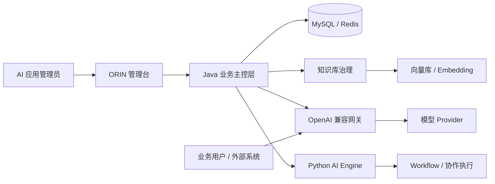

# ORIN

[](https://github.com/AdlinZ/ORIN/actions/workflows/ci.yml)
[](https://github.com/AdlinZ/ORIN/actions/workflows/codeql.yml)
[](https://github.com/AdlinZ/ORIN/actions/workflows/gitleaks.yml)
[](./docs/功能完成度.md#4-当前测试与覆盖率)
[](./scripts/docker-smoke.sh)
[](./VERSION)
[](./README.md#license)

> 面向企业 AI 应用管理员的智能体与知识库统一管理平台。

ORIN 用于集中建设企业知识、配置知识型智能体、验证回答与引用，并完成发布、观测和治理。它不是以工作流画布为中心的 LLM 应用搭建器，也不是某个外部平台的管理壳；产品主对象是企业自己的**智能体资产**和**知识资产**。

## 谁在使用 ORIN

核心使用者是企业数字化、信息化、AI 产品或数据团队中的 **AI 应用管理员**。这个角色负责：

- 把散落的文档建设成可检索、可验证的知识库；
- 选择模型并创建智能体，把经过验证的知识绑定给智能体；
- 调试回答、引用、耗时与错误语义，决定是否可以发布；
- 通过门户或 API 交付给业务用户，并持续查看 Trace、审计和用量。

业务人员主要消费已经发布的智能体与知识服务，不需要进入平台治理界面。

## 产品主线

ORIN 先管理三类核心资产，再按需启用高级执行能力：

| 核心资产 | 管理目标 | 首要验收标准 |
|----------|----------|--------------|
| 智能体 | 模型、提示词、知识绑定、调试与发布 | 能给出可核对的回答和引用 |
| 知识库 | 文档、解析、切分、向量化与检索 | 能看到处理状态并验证召回结果 |
| 模型 Provider | 模型连接、凭据引用、可用性与成本 | 能被智能体稳定调用且不暴露密钥 |

### 知识库黄金流程

```text
创建知识库 → 上传文档 → 查看解析与向量化状态 → 检索测试 → 确认召回结果
```

### 智能体黄金流程

```text
接入模型 → 创建智能体 → 绑定知识库 → 调试回答与引用 → 发布 → Trace / 审计 / 用量治理
```

Workflow、MCP、多智能体协作、知识图谱和多模态属于高级能力。它们服务于上述主流程，但不与智能体和知识库并列成为产品入口。

## 平台如何工作


```mermaid
flowchart LR
    A["AI 应用管理员"] --> C["ORIN 管理台"]
    C --> J["Java 业务主控层"]
    J --> D[("MySQL / Redis")]
    J --> K["知识库治理"]
    J --> G["OpenAI 兼容网关"]
    J --> P["Python AI Engine"]
    K --> V["向量库 / Embedding"]
    G --> M["模型 Provider"]
    P --> X["Workflow / 协作执行"]
    U["业务用户 / 外部系统"] --> G
```

- **Java 后端**是业务实体、权限、审计和配置的唯一持久化方。
- **Vue 管理台**围绕智能体、知识库和高级能力组织操作入口。
- **Python AI Engine**只承载工作流和协作执行，不直连业务数据库。
- **OpenAI 兼容网关**统一处理调用、API Key、Trace、限流与配额。

## 当前能力

| 领域 | 当前可用能力 | 仍需真实环境验收 |
|------|--------------|------------------|
| 智能体 | 列表、接入、工作台、会话、网关调用 | 真实 Provider 对话、知识绑定回答 |
| 知识库 | 知识资产、文档处理入口、检索测试 | Milvus、Embedding、完整上传检索闭环 |
| 模型 | Provider 配置、模型管理、定价配置 | 各 Provider 的真实凭据与稳定性 |
| 治理 | API Key、Trace、审计、运行监控 | 生产流量、告警与容量验证 |
| 高级能力 | Workflow、MCP、多智能体协作入口与执行骨架 | RabbitMQ、复杂节点和真实协作子任务 |

页面存在不等于能力已经闭环。逐模块成熟度、依赖和验收口径见 [功能完成度](./docs/功能完成度.md)。

## 30 秒启动

```bash
git clone https://github.com/AdlinZ/ORIN.git
cd ORIN
cp .env.example .env
docker compose --env-file .env up --build -d
```

启动后访问：

- 管理台：<http://localhost:5173>
- 后端与 Swagger：<http://localhost:8080/swagger-ui/index.html>
- AI Engine：<http://localhost:8000>

`.env.example` 只适合本机 smoke。真实部署必须替换密码、`JWT_SECRET`、`ORIN_DEFAULT_ADMIN_PASSWORD` 和 CORS 配置。MySQL 初始化使用 `docker/mysql/init/01-orin-schema.sql` 快照，再由 Flyway 补跑后续迁移。

常用验证：

```bash
# Docker 运行态 smoke
bash scripts/docker-smoke.sh

# 三端启动后的 HTTP smoke
bash scripts/smoke-test.sh

# 版本真相一致性
bash scripts/check-version-consistency.sh
```

`business-smoke.sh` 默认覆盖 API Key、MCP、Workflow、Collaboration 与 Trace。产品黄金流程（知识库上传/检索 → 智能体绑定 → 基于知识回答）需真实依赖后显式开启：

```bash
ORIN_BUSINESS_SMOKE_KNOWLEDGE_GOLDEN=1 \
ORIN_BUSINESS_SMOKE_AGENT_ID=<provider-backed-agent-id> \
bash scripts/business-smoke.sh
```

## 技术栈与目录

| 层级 | 选型 |
|------|------|
| 后端 | Spring Boot 3.2 · MySQL 8 · Redis · MyBatis/JPA |
| 前端 | Vue 3 · Vite · Element Plus · Pinia |
| AI 引擎 | Python 3.11 · FastAPI · LangGraph |
| 基础设施 | Redis · RabbitMQ · Milvus（可选） |

```text
ORIN/
├── orin-backend/      Java 业务主控、权限、审计与统一网关
├── orin-frontend/     智能体与知识库管理台
├── orin-ai-engine/    Workflow / 多智能体协作执行引擎
├── orin-mcp-bridge/   可选 MCP 客户端桥接
├── docker/            本地基础设施
├── scripts/           校验、部署与 smoke 脚本
└── docs/              产品、架构、使用与开发文档
```

## 外部集成与高级能力

ORIN 可以接入 Dify、RAGFlow、远程 MCP Server 和其他模型服务，但这些都是可选 Provider 或数据同步适配器，不定义 ORIN 的产品交互。新用户应先完成知识库与智能体黄金流程，再配置高级能力。

- MCP 客户端配置：[docs/mcp-client-setup.md](./docs/mcp-client-setup.md)
- 高级执行架构：[docs/架构设计.md](./docs/架构设计.md)
- 外部接口分组：[docs/API文档.md](./docs/API文档.md)

## 文档导航

| 文档 | 用途 |
|------|------|
| [使用指南](./docs/使用指南.md) | 核心人物、黄金流程、菜单与验收入口 |
| [功能完成度](./docs/功能完成度.md) | 哪些能力可用、条件可用或尚未闭环 |
| [路线图](./docs/路线图.md) | 智能体与知识库优先的开发顺序 |
| [架构设计](./docs/架构设计.md) | 三层边界、接口前缀与执行约束 |
| [部署指南](./docs/部署指南.md) | 环境变量、本地与生产部署 |
| [角色矩阵](./docs/角色矩阵.md) | AI 应用管理员、平台管理员与业务用户边界 |
| [开发规范](./docs/开发规范.md) | 编码、测试和 PR 必检项 |
| [CONTRIBUTING.md](./CONTRIBUTING.md) | 贡献流程 |

## 版本与状态

当前产品线：`0.2.0`。根目录 [VERSION](./VERSION) 是仓库版本唯一真相源。三端构建清单、MCP Server 和 MCP bridge 必须与它保持一致。

当前基线可启动、可构建，智能体、知识库、模型、API Key、Trace 与审计均有真实代码入口。依赖真实 Provider、Milvus、RabbitMQ 或外部客户端的能力属于条件能力，不应仅凭页面或 mock E2E 宣称完整交付。

## License

MIT
